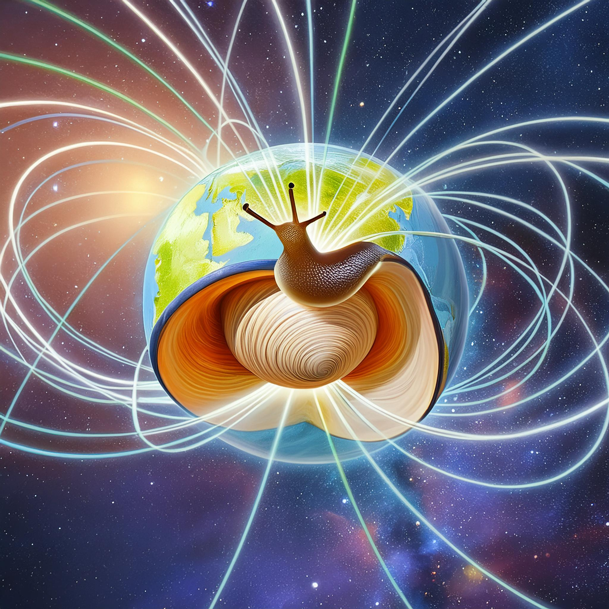

# Limace.jl
_**Li**near **m**odes **a**t the **c**ore of **E**arth_
_**L**inear **I**nertial **MA**gneto **C**oriolis **E**igenmodes_
_**L**inear **I**nertial **M**agneto **A**rchimedes **C**oriolis **E**igenmodes_

[](https://fgerick.github.io/Limace.jl/stable/) [](https://fgerick.github.io/Limace.jl/dev/) [](https://github.com/fgerick/Limace.jl/actions/workflows/CI.yml?query=branch%3Amain) [](https://codecov.io/gh/fgerick/Limace.jl)



Solve for linear eigenmodes of the rotating magnetohydrodynamics equations in a sphere.

## Installation
Simply run
```julia
import Pkg; Pkg.add("https://github.com/fgerick/Limace.jl.git")
```

## Example: Inviscid inertial modes

For the inviscid inertial modes in a full sphere:
```julia
using Limace, LinearAlgebra

N = 10 #polynomial truncation
basis = Inviscid(N) #create Galerkin basis
A = Limace.coriolis(basis) #assemble Coriolis operator matrix (sparse)
λ = eigvals(Matrix(A)) #solve for eigenvalues
```
Note, the `Inviscid` basis is orthonormal, so that we do not need to calculate an operator associated with inertia.

We can check against analytical values available from the literature (Zhang et al. 2008):
```julia
function zhang(m, N) 
	sm = sign(m)
	m = abs(m)
	return -sm*2 / (m + 2) * (√(1 + m * (m + 2) / (N * (2N + 2m + 1))) - 1) * im
end

any(λ .≈ zhang(1, 1)) #true
any(λ .≈ zhang(2, 1)) #true
any(λ .≈ zhang(3, 1)) #true

```

More examples are in the [documentation](https://fgerick.github.io/Limace.jl/stable/) and the `test/modes.jl` file.

## Citation
