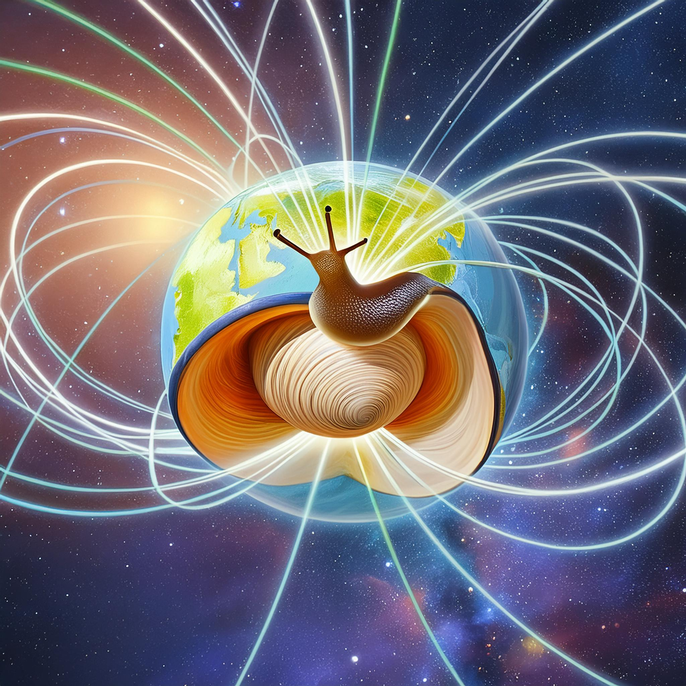

# Limace.jl
_**L**inear **I**nertial **M**agneto **A**rchimedes **C**oriolis **E**igenmodes_

[](https://fgerick.github.io/Limace.jl/dev/) [](https://github.com/fgerick/Limace.jl/actions/workflows/CI.yml?query=branch%3Amain) [](https://codecov.io/gh/fgerick/Limace.jl)



Solve for linear eigenmodes of the rotating magnetohydrodynamics equations in a sphere.

## Installation
Simply run
```julia
import Pkg; Pkg.add(url="https://github.com/fgerick/Limace.jl.git")
```

## Examples 

### Inviscid inertial modes

For the inviscid inertial modes in a full sphere:
```julia
using Limace, LinearAlgebra

N = 10 #polynomial truncation
basis = Inviscid(N) #create Galerkin basis
A = Limace.coriolis(basis) #assemble Coriolis operator matrix (sparse)
λ = eigvals(Matrix(A)) #solve for eigenvalues
```
Note, the `Inviscid` basis is orthonormal, so that we do not need to calculate an operator associated with inertia.

We can check against analytical values available from the literature ([Zhang et al. 2001](https://doi.org/10.1017/S0022112001004049)):
```julia
function zhang(m, N) 
	sm = sign(m)
	m = abs(m)
	return -sm*2 / (m + 2) * (√(1 + m * (m + 2) / (N * (2N + 2m + 1))) - 1) * im
end

any(λ .≈ zhang(1, 1)) #true
any(λ .≈ zhang(2, 1)) #true
any(λ .≈ zhang(3, 1)) #true

```

### Malkus modes

We create our two Bases for the flow and the magnetic field.
```julia

N = 6
u = Inviscid(N)
b = PerfectlyConducting(N)
bases = [u,b]
```
Without specifying the azimuthal wave number $m$ all $m \in [-l,l]$ with $l \in [1,N]$ are included. In the case of the Malkus field, this is not necessary, but in general (when $\mathbf{B}_0$ consist not only of $m=0$ components) we couple all $m$.

The background magnetic field $\mathbf{B}_0 = s \mathbf{e}_z$ is defined and we choose our characteristic time scale as the Alfvén time, so that our nondimensional parameter is the Lehnert number.
```julia
B0 = BasisElement(b, Toroidal, (1,0,0), 2sqrt(2pi/15)) # corresponds to B_0 = s e_z
Le = 1e-2
```
Then, we can include the necessary forcings in our setup:
```julia
forcings = [Limace.Inertial(u), Limace.Coriolis(u, 1/Le), Limace.Lorentz(u, b, B0),
			Limace.Inertial(b), Limace.InductionB0(b,u,B0)]
```
We create a `LimaceProblem`
```julia
problem = LimaceProblem(bases, forcings)
```
that can be assembled
```julia
Limace.assemble!(problem)
```

and then solved
```julia
Limace.solve!(problem)
```

The eigenvalues are then
```julia
λ = problem.sol.values
```

We can again compare to the analytical solutions:
```julia
function zhang(m, N) 
	sm = sign(m)
	m = abs(m)
	return -sm*2 / (m + 2) * (√(1 + m * (m + 2) / (N * (2N + 2m + 1))) - 1) * im
end

# Malkus J. Fluid Mech. (1967), vol. 28, pp. 793-802, eq. (2.28)
slow(m, N, Le, λ = imag(zhang(m, N))) = im * λ / 2Le * (1 - √(1 + 4Le^2 * m * (m - λ) / λ^2))
fast(m, N, Le, λ = imag(zhang(m, N))) = im * λ / 2Le * (1 + √(1 + 4Le^2 * m * (m - λ) / λ^2))


for m = vcat(-(N-1):-1, 1:(N-1))
	@show any(isapprox(slow(m,1,Le)),λ)
	@show any(isapprox(fast(m, 1, Le)),λ)
end
```

More examples are in the [documentation](https://fgerick.github.io/Limace.jl/dev/) and the `test/modes.jl` file.

## Contributing

See the [guidelines in the documentation](https://fgerick.github.io/Limace.jl/dev/contribute/) on how to contribute to this project.

## Citation
