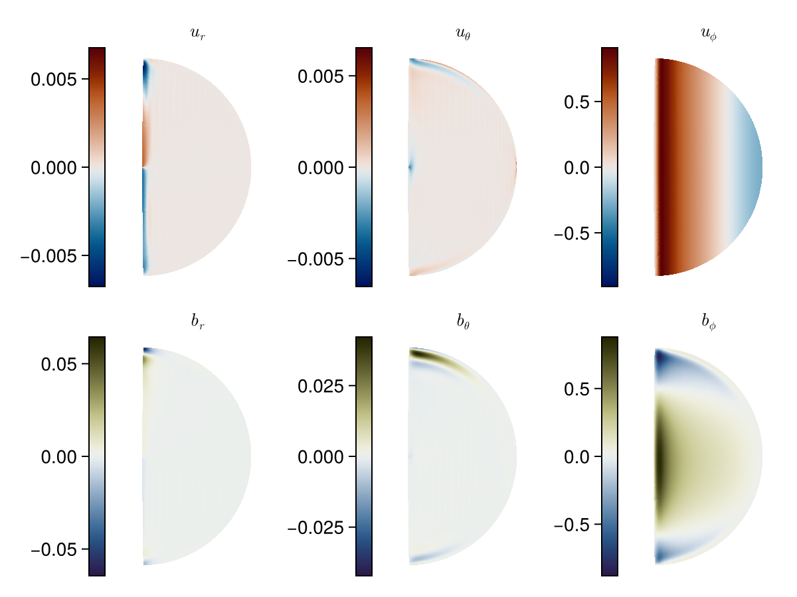

# Summary

Hydromagnetic modes in spherical domains are relevant to the liquid cores of planets, moons or stars, as well as rotating fluid dynamics experiments.
These modes are solutions to the rotating magnetohydrodynamic equations that govern electrically conducting fluids under rapid rotation. 
`Limace.jl` is a package written in the Julia programming language [@bezansonjulia2017], based on Galerkin projections of the governing equations onto 
trial vectors of the velocity and magnetic field. It aims to facilitate the calculation of modes in flexible setups with a high-level interface,
whilst remaining computationally performant enough to tackle relevant physical parameters.


# Statement of need

- No open-source framework for hydromagnetic modes
- Several in-house closed source codes exist in the community
- Reimplementation requires substantial effort due to complexity of the spectral equations
- Generic and does not rely on symmetry assumptions.


# Theoretical background

The modeled equations are based on the work of [@iversscalar2008] and [@gerickinterannual2024].

# Basic Example - Torsional Alfvén mode

Load the relevant packages

````julia
using Limace, SparseArrays, CairoMakie
using Limace.EigenProblem: eigstarget
using Limace.Discretization: spectospat
````

## Assembly

We can assemble the submatrices and concatenate them to get our final left hand side matrix `LHS` and right hand side matrix `RHS`.

Here, the non-dimensional parameters are the Lehnert number `Le` and the Lundquist number `Lu`. We give the resolution by an integer `N`, that determines the polynomial degree of our solutions.
This function takes for `B0` a collection of `BasisElement`'s, as shown below.

````julia
function assemble(N, Le, Lu, B0)
	u = Inviscid(N; m=0)
	b = Insulating(N; m=0)
	LHS = blockdiag(sparse(Limace.inertial(u),length(u),length(u)), sparse(Limace.inertial(b)))
	RHSc = Limace.coriolis(u)/Le
	RHSl = sum(Limace.lorentz_threaded(u,b,B) for B in B0)
	RHSi = sum(Limace.induction_threaded(b,u,B) for B in B0)
	RHSd = Limace.diffusion(b)/Lu
	RHS = [RHSc RHSl
		   RHSi RHSd]
	return LHS, RHS, u, b
end
````

Define parameters and background magnetic field:

````julia
N = 100
Le = 5e-4
Lu = 1/Le
B0 = [BasisElement(Basis{Insulating}, Poloidal, (1,0,1),0.3), BasisElement(Basis{Insulating}, Poloidal, (2,0,1),0.7)]
````

This background field is a mix of two poloidal field components, `l,m,n=(1,0,1)` and `l,m,n = (2,0,1)`, i.e. dipolar and quadrupolar symmetry.

Assemble the matrices:

````julia
LHS, RHS, u, b = assemble(N, Le, Lu, B0)
````

## Solve the eigen problem

We can calculate some eigenvalues and vectors near a given `target`. For torsional modes it is sensible to choose a target near `λ = -σ+im*ω = 1.0im`, i.e. an Alfvén frequency of 1 (note: this only the case, when using the Alfvén time as the characteristic time-scale in the nondimensionalization).

````julia
target = 1.0im
````

`Limace.jl` provides the `eigstarget` function, based on shift-invert spectral transform and an implicitly restarted Arnoldi method. The keyword `nev` can be set to the desired number of eigenvalues.

````julia
λ, x = eigstarget(RHS, LHS, target; nev=5)
````

## Plot the solution

We find the solution of largest real part, corresponding to the smallest damping rate. In this simple example this is enough to isolate the gravest torsional mode from the other calculated solutions.

````julia
per = sortperm(λ, by = real, rev=true)
````

We discretize the corresponding eigenvector in the meridional plane. Since $m=0$, we do not need more than one value of the longitude.

````julia
nr, nθ, nϕ = 2N+1, 2N+1, 1

ur,uθ,uϕ, br,bθ,bϕ, r,θ,ϕ = spectospat(x[:,per[1]], u,b, nr,nθ,nϕ)
````

We visualize can visualize the meridional slices of the velocity and magnetic field components (shown in Figure \autoref{fig:example}).

{ width=50%}

# Acknowledgements

I have received funding from the European Research Council (ERC) GRACEFUL Synergy Grant No. 855677. 
This project has been funded by ESA in the framework of EO Science for Society, through contract 4000127193/19/NL/IA (SWARM + 4D Deep Earth: Core). 
I thank Phil Livermore for the help in the theoretical development of the model.

# References
